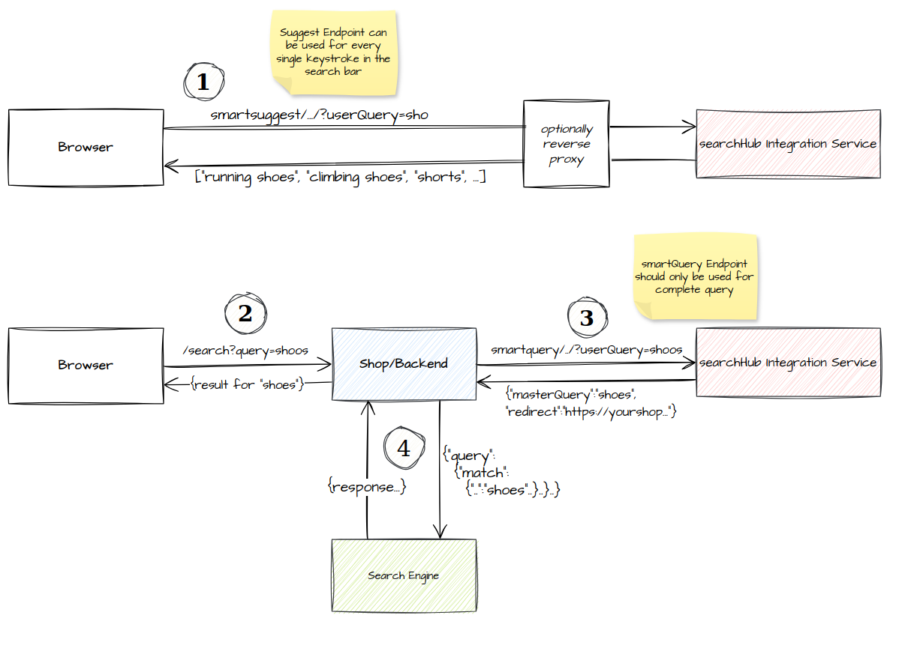

Common Operations
=================

.. note::

    This common operations section extends the module specific section `smartQuery operations`_ and `smartSuggest operations`_, specifically the HTTP service part.
    That's possible as the HTTP service for both modules are built from the same source base.

Principles
----------

Both modules are built in accordance with the `12-Factor App <https://12factor.net/>`_ methodology. The following points provide insights into how the modules are designed, developed, and encapsulated as RESTful/HTTP services (referred to simply as "services" in this section):

#. **Codebase and Compatibility**: Both module services are built from a single codebase and ensure full API backward compatibility.
#. **Dependency Management**: The modules share the same dependency management definition to prevent conflicts when embedded in larger Java applications. Dependencies are declared in the referenced parent Maven POM file, namely "searchhub-module-dependencies".
#. **Configuration** can be managed via volume mounts (e.g., Kubernetes config maps), system properties (startup parameters), or environment variables. (*Using a combination of these is possible but may lead to confusion.*)
#. **Backing Services**: Each module retrieves the required data from the central searchHub API and loads it into the application (whether embedded or containerized). The retrieved data is memory-efficient and disposable after use. Consequently, the modules do not require access to a database, persistent volumes, or other external storage.
#. **Build, release, run**: Both modules are delivered through automated CI/CD pipelines. They are rigorously tested for functionality and monitored with performance benchmarks.
#. **Processes**: Services are provided as containerized applications running a single Java process (PID 1).
#. **Port binding**: By default, the service runs on port **8081**, but this can be changed using the system property ``-Dserver.port=8082`` or the environment variable ``SERVER_PORT=8082``.
#. **Concurrency**: The services are synchronized with the central searchHub API and can scale horizontally as needed. Once running, the services operate independently of the API, ensuring no impact on functionality if the API connection is lost. However, maintaining the connection is recommended to receive data updates. More details are covered in the "Central API Connection" section.
#. **Disposability**: Yes, as described in 4. and 8.
#. **Dev/prod parity**: The services only use data gathered from the production system. Even in TEST or QA environments, the modules rely on productive searchHub data.
#. **Logs**: Application logs are logged in a standard format to stdout. Additionally, the smartQuery module collects event-based usage statistics and periodically send them to the central searchHub API in bulk. This is an asynchronous process using a limited buffer to avoid extensive memory consumption. If the connection to the central API is unavailable, usage statistics are dropped until the connection is restored.
#. **Admin processes**: The services expose usage metrics and other insights in Prometheus-compatible format at the ``/metrics`` and ``/prometheus`` endpoints. Both endpoints can be secured with basic authentication. The container image is based on a minimal Alpine Linux base, allowing shell access when necessary.

Dependencies
------------

Central API Connection
~~~~~~~~~~~~~~~~~~~~~~

Both modules pull their required data from ``https://query.searchhub.io`` using the required ``SH_API_KEY``. Per default that happens with the first access to the according resource, but asynchronously. For example if ``/smartquery/v2/$name/$channel?userQuery=xy`` is requested, then the service will immediately respond with the "empty default" result, but internally it will start pulling data for the tenant "$name.$channel". As soon as the data is loaded, the very same request might respond with more meaningful data (if available for that userQuery).

To avoid empty default responses at the beginning, a list of tenants can be defined (env-var ``SH_INIT_TENANTS`` or at the library directly during initialization). In that case, the according module will load the data for those tenants *synchronously*. For the service this means increased startup time, as the service will only be ready afterwards. But this will also improve availability, as the services can immediately respond with valid data.

smartQuery: Stats Transmitter
~~~~~~~~~~~~~~~~~~~~~~~~~~~~~

The smartQuery module will also collect event based usage stats and sends them to the central searchHub API ``https://import.searchhub.io`` in regular bulk requests. This is an asynchronous process using a limited buffer to avoid extensive memory consumption. If the connection to the central API is lost, usage stats are simply dropped until the central API is available again.

In case messages are dropped, there will be log messages warning about it, for example "searchhub stats transmitting failed {} times for tenant {}". That can happen in case of unavailability of the central API, but it can also happen, if the service gets more traffic than it can handle. Please contact us in case you have those kind of problems, as it might also be a symptom of a wrong integration.

smartSuggest: volatile disk space
~~~~~~~~~~~~~~~~~~~~~~~~~~~~~~~~~

The suggest module is based on `Apache Lucene Core <https://lucene.apache.org/core/>`_ used as an embedded library. As the created indexes need to be stored on disk, a temporary directory is necessary. Per default the OS default temporary directory is used, which is ``/tmp`` inside the service container.
It is possible to change that directory directly in the library API ``.indexFolder(..)`` or for the service using the system property ``-Dsuggest.index-folder=/your/tmp`` or env-var ``SUGGEST_INDEX_FOLDER``.

Service Topology
----------------

As the suggest module is required for requests from the frontend directly, it should be available without authentication restriction. However we recommend to use a load balancer or reverse proxy to distribute the incoming suggest-requests only to the required suggest endpoints. This way the other unused endpoints are not exposed.

The smartQuery module should be placed as close to the search-engine as possible, as it needs to be requested right before the search-engine.
However due the capability of reducing the amount of unique queries (different but similar user queries are mapped to the very same user query), it might be a good idea to place this before the search-engine cache (if available) to increase cache-hit-ratio.
Another exceptional scenario is a search-engine integrated into frontend, so that its requested directly from the browser. In that case we recommend to use the ``/smartsuggest/v4`` endpoint, that delivers both service responses with a single request.

Combined HTTP Service
~~~~~~~~~~~~~~~~~~~~~

We use the same code base to build the combined image ``commerceexperts/searchhub-integration-service:latest`` and the dedicated service images ``commerceexperts/smartquery-service:${SMARTQUERY_VERSION}`` and ``commerceexperts/searchhub-smartsuggest-service:${SMARTSUGGEST_VERSION}``. That's why the common properties and the common endpoints work for all those image.

The combined service is especially important for the ``/smartsuggest/v4`` endpoint, as that endpoint uses the smartQuery module to enrich the suggest response with mapping information. But you can also use it if you want to run both services next to each other anyways.

Operational Endpoints
---------------------

/up:
    is a simple static endpoint, that will respond with http code 200 as soon as the container is started

``/health``:
    gives more details about the loaded modules and which tenants are loaded respectively. For example:

    .. code-block:: json
    
        {
            "smartquery": {"tenant.one": "Ready", "tenant.two": "Noop"},
            "suggest": {"tenant.one": "Ready", "tenant.two": "NotReady"}
        }

:code:`/prometheus` and :code:`/metrics` provide access to insight metrics. The module specific metrics are described in the according module section.
Additional the following service metrics are exposed.

Monitoring
----------

.. glossary::

    http_server_requests_count
        Total number of all requests measured

    http_server_requests_error_count
        total number of requests that were responded with http code >= 400

    http_server_requests_seconds
        total request time of all requests measured. Can be used to calculate rate and total average.

    http_server_requests_seconds_min
        fastest request measured so far

    http_server_requests_seconds_max
        slowest request measured so far

These metrics are labeled with the label "endpoint" having the value "smartsuggest" or "smartquery".

In case the property `server.metrics.jvmMemory.enable=true` is set, there will be several metrics exposed around the JVM Memory management. Those metrics have the prefixes ``jvm_memory_``, ``jvm_gc_`` and ``jvm_buffer_``.

In case the property `server.metrics.jvmThreads.enable=true` is set, there will be several metrics exposed with the prefix ``jvm_threads`` describing details of JVM Thread management.

Configuration
-------------

You could either overwrite the file ``/app/resources/service.properties`` inside the container with all properties adjusted, or you can overwrite single properties using the ``JAVA_OPTS`` environment variable. The properties set via ``JAVA_OPTS`` will always take precedence over the ones in the file. In this documentation all examples are shown with the ``JAVA_OPTS`` environment variable, if you combine them, make sure to define that environment variable only once for all properties.

Module Activation
~~~~~~~~~~~~~~~~~

In case you are using the combined service image ``commerceexperts/searchhub-integration-service``, both modules are only activated the first time the according endpoint is used.
This may lead to unwanted behaviour, as the service then needs some time before the data is actually available. Until then only default response objects are delivered.
So alternatively you can activate the modules during startup:

.. code-block:: bash

    JAVA_OPTS="-Dsmartquery.initOnStartup=true -Dsuggest.initOnStartup=true"

The dedicated variants of that service come with the corresponding module activated.

Basic Authentication
~~~~~~~~~~~~~~~~~~~~

In case you want to enable basic authentication for all the endpoints, add the following properties to the `JAVA_OPTS` environment variable.

.. code-block:: bash

    JAVA_OPTS="-Dserver.auth.all.enable=true -Dserver.auth.username=<username> -Dserver.auth.password=<your-password>"

Instead of enabling authentication for all endpoints, it's also possible to only enable authentication for some endpoints only. Therefor omit the ``-Dserver.auth.all.enable=true``
property and instead only use the desired ones of the following properties:

.. code-block:: bash

    JAVA_OPTS="-Dserver.auth.smartquery.enable=true -Dserver.auth.suggest.enable=true -Dserver.auth.management.enable=true"

Port and Address
~~~~~~~~~~~~~~~~

In case you want to change the listening port and/or address of the internal java server, these are the properties for you. Don't confuse that with the mapped port of your container whatsoever.

.. code-block:: bash

    JAVA_OPTS="-Dserver.port=<port> -Dserver.address=<0.0.0.0>"

Detailed JVM Metrics
~~~~~~~~~~~~~~~~~~~~

If you are interested in detailed JVM metrics (memory and thread stats), you can enable the instrumentation of those. They are then also available via the ``/prometheus``
and ``/metrics`` endpoint.

.. code-block:: bash

    JAVA_OPTS="-Dserver.metrics.jvmMemory.enable=true -Dserver.metrics.jvmThreads.enable=true"

Update Rate
~~~~~~~~~~~

Sets the rate (in seconds) at which the background update should check for new data. The value must be between 5 and 3600. Defaults to 60. The update rates of smartQuery and smartSuggest are set separately. If you notice problems with your memory or CPU resource, because both modules start their updates at the same time, you might want to set different prime numbers as update rates.

.. code-block:: bash

    JAVA_OPTS="-Dsmartquery.updateRateInSeconds=83 -Dsuggest.update-rate=719"

(*The different property names have historical reason and are kept for legacy support*)

Preload Tenants
~~~~~~~~~~~~~~~

You can specify the tenants that should be loaded during startup. The service will only be ready (listening on the given port) after those tenants are loaded.

There are two ways to set the preload tenants. Either set the ``SH_INIT_TENANTS`` environment variable directly
or if you're already using the ``JAVA_OPTS`` environment variable, you can add it as a part of it:

.. code-block:: bash

    SH_INIT_TENANTS="example.num1,example.num2"
    # alternative:
    JAVA_OPTS="-Dsmartquery.preloadTenants=example.num1,example.num2"

.. _smartQuery operations: smartquery/operations.html
.. _smartSuggest operations: smartsuggest/service-operations.html
